## Project Structure

```
1_MLOPS_marks_prediction_end_to_end_project/
├── app.py
├── Dockerfile
├── README.md
├── requirements.txt
├── setup.py
├── src/
│   ├── __init__.py
│   ├── exception.py
│   ├── logger.py
│   ├── utils.py
│   ├── components/
│   │   ├── data_ingestion.py
│   │   ├── data_transformation.py
│   │   ├── model_trainer.py
│   └── pipline/
│       ├── predict_pipeline.py
├── templates/
│   ├── home.html
│   ├── index.html
│   └── style.css
├── artifacts/
│   ├── data.csv
│   ├── model.pkl
│   ├── proprocessor.pkl
│   ├── test.csv
│   └── train.csv
└── ...
```


## Student Exam Performance Prediction (MLOps End-to-End Project)

This project is an end-to-end MLOps application that predicts a student's math score based on demographic and academic features. It uses machine learning models and a FastAPI web interface for user interaction.

---

### Key Features
- Predicts math scores using inputs like gender, ethnicity, parental education, lunch type, test preparation course, writing score, and reading score.
- FastAPI backend for serving predictions and user interface.
- Dockerized for easy deployment and scalability.
- Automated CI/CD pipeline with GitHub Actions, building and pushing images to AWS ECR.
- Cloud deployment on AWS (EC2) for public access.

---
## Visual Pipeline Overview

```mermaid
flowchart TD
	%% === LOCAL DEVELOPMENT ===
	subgraph LOCAL["🧩 Local Development"]
		A["Data Ingestion"]
		B["Data Transformation"]
		C["Model Training & Optimization"]
		D["Prediction Pipeline"]
	end

	%% === CI/CD PIPELINE ===
	subgraph Docker["Dockerize"]
		E["Dockerize Application"]
        F["Build & Test Docker Image"]
	end

	%% === CI/CD PIPELINE ===
	subgraph CI_CD["⚙️ CI/CD Pipeline (GitHub Actions)"]
		G["Push to GitHub Repository"]
		G["Continuous Integration"]
		I["Push Image to AWS ECR"]
	end

	%% === CLOUD DEPLOYMENT ===
	subgraph DEPLOY["☁️ Cloud Deployment (AWS)"]
		J["AWS EC2 (Self-Hosted Runner)"]
		K["Pull Docker Image from ECR"]
		L["Run Container & Serve FastAPI App"]
		M["User Access via Public URL"]
	end

	%% === FLOW BETWEEN STAGES ===
	LOCAL --> Docker --> CI_CD --> DEPLOY

	%% === STYLES ===
	style LOCAL fill:#e0f7fa,stroke:#00838f,stroke-width:2px
	style CI_CD fill:#f3e5f5,stroke:#6a1b9a,stroke-width:2px
	style DEPLOY fill:#fbe9e7,stroke:#bf360c,stroke-width:2px
	style M fill:#c8e6c9,stroke:#2e7d32,stroke-width:2px
	classDef node fill:#ffffff,stroke:#333,stroke-width:1px,rx:6px,ry:6px
	class A,B,C,D,E,F,G,H,I,J,K,L,M node
```



## Project Workflow & Life Cycle

1. **Data Ingestion**
	- Raw data is collected and ingested into the system for further processing.

2. **Data Transformation**
	- The ingested data is cleaned, preprocessed, and transformed to prepare it for model training.

3. **Model Training and Optimization**
	- The transformed data is used to train machine learning models. Hyperparameter optimization is performed to select the best model configuration.

4. **Prediction Pipeline**
	- The trained model is deployed in a prediction pipeline. User inputs are processed, and the system predicts the math score based on the provided features.

5. **User Interaction**
	- Users enter student details in the web form. The FastAPI backend processes input and returns the predicted math score.

---

## Deployment Lifecycle

1. **Docker Image Creation**
	- Build a Docker image containing the application and all its dependencies.

2. **CI/CD Pipeline Configuration**
	- Set up GitHub Actions to automate continuous integration and continuous delivery (CI/CD).

3. **Push Docker Image to AWS ECR**
	- Use the CI/CD pipeline to build and push the Docker image to Amazon Elastic Container Registry (ECR).

4. **Self-Hosted Runner Setup**
	- Register a self-hosted runner with GitHub Actions to handle deployment tasks on AWS infrastructure.

5. **EC2 Instance Provisioning**
	- Launch an AWS EC2 instance to serve as the host for the application container.

6. **Application Deployment**
	- Pull the Docker image from ECR and run it on the EC2 instance, exposing the required port for public access.


## Live Demo

> The application was initially deployed and tested on AWS EC2 to demonstrate cloud deployment and MLOps best practices. For ongoing public access and to avoid cloud costs, the demo is hosted on Hugging Face Spaces.

You can try the deployed application here: [Student Exam Performance Predictor](https://huggingface.co/spaces/ataa599/studentperformance)

